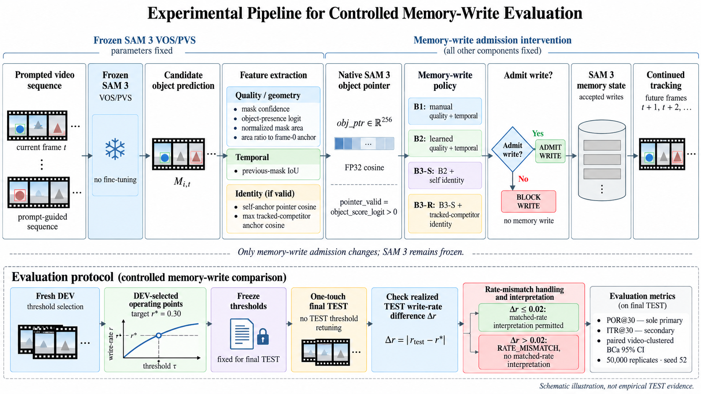
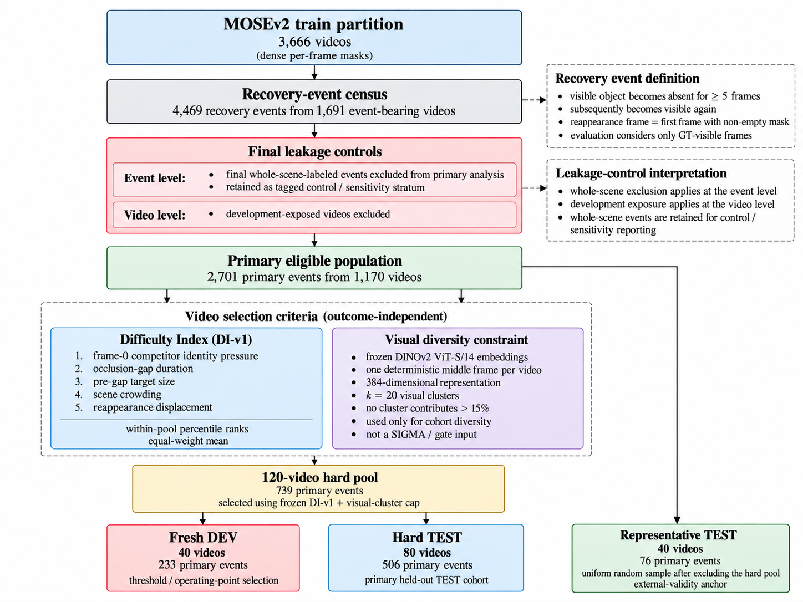

# Chapter 3 - Experimental Methodology

## 3.1 Study Design

This thesis uses a controlled intervention design to study one specific
decision inside a frozen video object segmentation tracker: whether a
non-conditioning prediction should be allowed to become future memory.

The research question is:

> What information should a memory-write gate use — quality signals, temporal
> signals, or identity signals?

The design therefore separates three issues that are often conflated in
end-to-end tracker comparisons:

1. the quality of the underlying segmentation model;
2. how frequently memory is updated; and
3. which information is used to decide whether a candidate write is admitted.

SAM 3 is held fixed throughout the final study. The experimental intervention
acts only on memory-write admission. Signal families are introduced through a
nested ladder so that each comparison asks an incremental information question
rather than comparing unrelated tracker architectures.

<!-- INTEGRATED_FIGURE:FIG3_1 -->

The leakage-controlled experimental sequence is summarized in
[Figure 3.1](#fig-3-1).

**Figure 3.1 — Experimental pipeline for controlled memory-write evaluation.**
Development data determine the frozen operating points without TEST outcome
optimization. TEST comparisons use the pre-specified direct write-rate
criterion between compared methods; a pooled absolute difference greater than
0.02 is labelled `RATE_MISMATCH`. Primary uncertainty is quantified with
paired video-clustered BCa inference for POR@30.

## 3.2 Frozen SAM 3 Substrate

The final substrate is SAM 3 VOS/PVS, instantiated using
`build_sam3_video_model()` and the frozen `facebook/sam3/sam3.pt` checkpoint.

The SAM 3 model is not fine-tuned. No gradient, LoRA module, detector
modification, or additional SAM architecture is introduced. The gate is a
small external decision module whose parameter count remains well below the
50,000-parameter thesis limit.

The frozen repository revision used for the SAM 3 source is:

`8f0b7f4d4e7eda2ed606ebde6702c93359ad01da`

SAM 3.1 Multiplex is not the final thesis substrate. Earlier hardware
evaluation showed that the Multiplex path required approximately 21.77 GB of
VRAM and therefore did not fit the available 16 GB RTX 4080 SUPER. The VOS/PVS
path both fit the available hardware and exposed the per-object signals needed
for the locked research question.

The experimental interpretation is consequently limited to the frozen SAM 3
VOS/PVS memory interface.

## 3.3 Dataset Choice

The study uses MOSEv2.

The densely annotated training partition contains 3,666 videos with per-frame
object masks and is used as the source population for development and held-out
evaluation cohort construction.

The provided MOSEv2 validation partition is not used for the thesis endpoints
because it does not contain the dense per-frame masks required to determine
visibility gaps, recovery events, target IoU trajectories, or relational theft
outcomes.

This is not a conventional use of the official train/validation split.
Instead, the thesis constructs leakage-controlled video-level development and
TEST cohorts from the densely annotated training partition.

[[CITE:MOSEv2]]

## 3.4 Recovery-Event Definition

A recovery event is defined from ground-truth visibility.

For an object to generate a qualifying event:

1. the object is visible;
2. it becomes absent for at least five consecutive frames; and
3. it subsequently becomes visible again.

The reappearance frame is the first frame after the qualifying gap with a
non-empty ground-truth target mask.

Post-reappearance evaluation uses only frames in which the target is
ground-truth visible.

A full scan of the 3,666-video MOSEv2 training partition produced:

- 1,691 videos containing at least one qualifying recovery event;
- 3,237 event-bearing tracks; and
- 4,469 raw recovery events.

These quantities describe the pre-exclusion event census and are not
themselves the final primary evaluation population.

## 3.5 Whole-Scene Event Control

Early analysis identified groups of objects disappearing and reappearing at
similar times. Timing synchronization was initially suspected to indicate
whole-scene occlusion, but visual audit showed that synchronization alone was
not a valid semantic definition. Some cases instead reflected camera motion,
out-of-view motion, or other local phenomena.

Consequently, synchronized timing is not used as the final whole-scene label.

Final whole-scene status is based on the frozen whole-scene labelling
procedure recorded in the experimental history. Whole-scene-labelled events
are retained in the corpus as a tagged control/sensitivity stratum but are
excluded from the primary POR population.

This distinction is important:

- whole-scene handling occurs at the event level; and
- development exposure is handled separately at the video level.

Whole-scene events are therefore not silently deleted from the dataset.

## 3.6 Development-Exposure Firewall

Any video that had previously been used for model development, exploratory
tracking analysis, gate training, or development evaluation was excluded from
the final eligible TEST population.

This rule uses video identity, not individual events, as the exposure
boundary. If a video was development-exposed, no event from that video could
later enter the held-out final TEST cohorts.

After excluding final whole-scene primary events and development-exposed
videos, the final primary eligible population contained:

- 2,701 primary events;
- 1,170 videos.

This population is the source from which the final hard and representative
evaluation cohorts were constructed.

## 3.7 Outcome-Independent Difficulty Index

The primary held-out cohort was deliberately enriched for difficult recovery
conditions without using tracker recovery outcomes.

Difficulty was therefore defined using observable, outcome-independent
covariates only.

The frozen DI-v1 contains five components:

1. frame-0 competitor identity pressure;
2. occlusion-gap duration;
3. pre-gap target size;
4. scene crowding; and
5. reappearance displacement.

Each component is converted to a within-population percentile rank. The final
DI-v1 score is the equal-weight arithmetic mean of the five ranks.

For the target-size component, smaller pre-gap targets are ranked as harder.

For identity pressure, only frame-0 anchor descriptors are used. No future
tracking outcome, recovery result, POR value, or TEST prediction enters the
difficulty score.

The difficulty index is therefore a dataset-construction variable rather than
an outcome variable.

## 3.8 Visual-Diversity Constraint

Difficulty ranking alone can concentrate visually similar videos. To reduce
this risk, a separate outcome-independent visual-diversity constraint is
applied during hard-pool construction.

One deterministic middle frame is selected from each of the 1,170 eligible
videos. A frozen DINOv2 ViT-S/14 backbone produces one 384-dimensional visual
embedding per video.

The embeddings are used only for diversity control.

They are:

- not gate features;
- not tracking outcomes;
- not used for threshold selection;
- not trained on the thesis data; and
- not exposed to Fresh DEV or TEST outcomes.

The frozen clustering procedure uses k=20 visual clusters, and the hard-set
construction restricts any one visual cluster to at most 15% of the selected
hard pool.

The visual embedding therefore affects cohort diversity, not gate inference.

## 3.9 Final Cohort Construction

The frozen DI-v1 ranking and visual-cluster constraint define a 120-video hard
pool containing 739 primary events.

This hard pool is partitioned at video level into:

### Fresh DEV

- 40 videos;
- 233 primary events.

Fresh DEV is used for threshold and operating-point selection only.

### Hard TEST

- 80 videos;
- 506 primary events.

Hard TEST is the primary held-out evaluation cohort.

### Representative TEST

A second held-out cohort is sampled uniformly from the primary eligible
population after excluding the entire 120-video hard pool.

It contains:

- 40 videos;
- 76 primary events.

Representative TEST is an external-validity anchor. It is not used to replace
the primary Hard TEST cohort and is not used for model or threshold selection.

<!-- INTEGRATED_FIGURE:FIG3_2 -->

The final leakage-controlled cohort construction is summarized in
[Figure 3.2](#fig-3-2).

**Figure 3.2 — Leakage-controlled construction of the final MOSEv2-derived
cohorts.** The final primary population contains 1,170 development-unexposed
videos and 2,701 primary events. Outcome-independent DI-v1 difficulty ranking
and visual-diversity control define the 120-video hard pool, from which
Fresh DEV and HARD_TEST80 are separated at video level. The independent
REPRESENTATIVE_TEST40 cohort is sampled after excluding the complete hard
pool.

## 3.10 Experimental Ladder

The final ladder contains six conditions.

### B0 — Native reference

B0 is the frozen SAM 3 tracker at its native physical write behaviour.

B0 is not forced to the common write budget and therefore is not treated as a
matched-rate reference.

### B1 — Manual quality-plus-temporal rule

B1 uses the prospectively frozen manual reliability rule defined before final
evaluation.

Its inputs correspond to quality, area consistency, and temporal consistency
signals. It serves as a non-learned reference for the same broad information
family used by B2.

### B2 — Learned quality-plus-temporal gate

B2 is the final learned five-feature gate.

Its frozen predictive inputs are:

- `mask_conf_iou_head`;
- `occ_score_logit`;
- `area_norm`;
- `area_ratio_anchor`;
- `temporal_iou_prev`.

These inputs represent prediction quality, presence confidence, mask geometry,
and temporal consistency.

### B3-S — Self-identity extension

B3-S inherits all five B2 features and adds:

- `ptr_sim_anchor_fp32`.

This feature is the FP32 cosine similarity between the current native SAM 3
object pointer and the trusted self anchor.

B3-S therefore asks whether native self-identity information adds useful
evidence beyond the learned B2 formulation.

### B3-R — Relational identity extension

B3-R inherits B3-S and adds:

- `max_comp_anchor_cos_fp32`.

This is the maximum FP32 cosine similarity between the current target pointer
and trusted anchors of other currently tracked objects.

B3-R therefore asks whether tracked-competitor relational identity adds
information beyond self identity.

The signal refers specifically to tracked competitors. It is not a generic
external distractor detector.

### B5 — DMS-lite write-side comparator

B5 is a prospectively frozen write-side comparator inspired by the reliability
signal used by SAM3-DMS.

It is not an exact reproduction of SAM3-DMS.

For object i, the final B5 score uses only the frozen SAM 3 mask-confidence
and object-presence outputs.

Presence is:

`0`, when `occ_score_logit <= 0`;

otherwise:

`2 * sigmoid(occ_score_logit) - 1`.

The object score is:

`presence * mask_conf_iou_head`.

No identity signal or learned gate output is used by B5.

## 3.11 Gate Training Labels

The learned gates predict two distinct failure types.

### Drift

Drift is defined from target overlap only:

`target_iou < 0.3`.

This definition is intentionally identity-free.

### Theft

Theft is relational and is defined using overlap with other tracked
ground-truth objects:

`max_other_iou > 0.5`.

The two labels are kept separate because they represent different failure
semantics.

Gray-zone examples that do not satisfy the frozen positive/negative training
definitions are excluded from gate training rather than being assigned an
arbitrary label.

The final learned models therefore use dual failure-typed heads: one for drift
risk and one for theft risk.

## 3.12 Learned Gate Architecture

For B2, B3-S, and B3-R, each failure type is predicted by an independent MLP
head with:

- input dimension d determined by the variant;
- Linear(d,64);
- ReLU;
- Linear(64,32);
- ReLU;
- Linear(32,1).

The two learned heads output drift and theft unsafe logits independently.

A shared TRAIN-only feature normalizer is used where specified by the frozen
training artifacts; the neural heads themselves are independent rather than a
single shared neural backbone.

## 3.13 Dual-Risk Safety Composition

For each object, the two unsafe probabilities are converted to safe
probabilities:

`p_safe_drift = 1 - p_unsafe_drift`

`p_safe_theft = 1 - p_unsafe_theft`

The final object admission score is:

`p_safe = min(p_safe_drift, p_safe_theft)`.

This conservative composition allows either predicted failure mode to veto a
write.

No post-hoc weighting coefficient or learned calibration layer is added after
the frozen gate definition.

## 3.14 Missingness and Identity Routing

Base-feature and identity missingness are handled differently.

### Non-finite B2 base features

If any required B2 base feature is non-finite, the object fails closed:

`object admission score = 0`.

The object remains part of the frame-level aggregation and can therefore block
the frame write.

### Pointer availability

The availability mask is:

`pointer_valid = object_score_logit > 0`.

`pointer_valid` is never supplied as a predictive input.

It is used only to determine which frozen gate variant is valid for the current
object.

The final routing is:

### B3-S

- self identity available -> use B3-S;
- self identity unavailable -> fall back to B2.

### B3-R

- relational identity available -> use B3-R;
- self identity only -> fall back to B3-S;
- self identity unavailable -> fall back to B2.

For a single-object frame, B3-R therefore reduces to B3-S when self identity is
available.

Unexpected non-finite identity values in a case where identity is expected to
be computable are treated as engineering defects rather than silently routed
around.

## 3.15 Identity Computation

All identity cosine computation is performed in FP32.

For the locked identity path:

- autocast is disabled;
- TF32 is disabled; and
- float32 matrix multiplication precision is set to `highest`.

The native SAM 3 object pointer is used directly. No learned external identity
embedding is introduced in the final thesis experiment.

## 3.16 Frame-Level Admission and Physical Intervention

The gate produces an object-level score for every tracked object.

The final frame score is:

`frame_score = minimum object score over all tracked objects`.

At the frozen operating threshold tau:

`ADMIT` if `frame_score >= tau`;

otherwise:

`BLOCK`.

The intervention applies to eligible non-conditioning frames.

A blocked frame is physically removed from the SAM 3 memory-write path using
the verified closed-loop intervention. Conditioning and prompt frames are
retained.

The intervention therefore changes future tracker state rather than merely
relabeling an offline prediction.

This distinction is central to the thesis: the gate is evaluated as a
closed-loop memory-write policy, not as an offline classifier.

## 3.17 Development Operating-Point Selection

The gated methods require a frozen operating threshold.

Threshold selection is performed using Fresh DEV only.

The target development write rate is:

`r* = 0.30`.

Thresholds are selected using realized write rate, not POR, ITR, or any other
tracking-performance outcome.

The final headline thresholds are:

- B1: 0.10;
- B2: 0.10;
- B3-S: 0.20;
- B3-R: 0.20;
- B5: 0.70.

B0 remains at its native write rate.

Supported development rate-sweep operating points are retained for
write-rate/performance curves rather than interpolating unsupported TEST
operating points after seeing outcomes.

## 3.18 Neutral Matched-Budget Controls

For each signal-based gated condition, the evaluation also includes a neutral
control with the same per-video write budget.

The neutral control admits exactly the same number of eligible writes per
video but does not use the signal policy to choose which frames are retained.

This separates two possible mechanisms:

1. benefit from writing less often; and
2. benefit from selecting which frames to write.

Neutral controls are therefore diagnostic controls for selection quality, not
alternative primary methods.

## 3.19 Frozen TEST Rate-Mismatch Rule

Development threshold matching does not guarantee identical realized write
rates on TEST.

The prospectively frozen direct-comparison tolerance is:

`absolute pooled TEST write-rate difference <= 0.02`.

If a direct comparison exceeds this tolerance, it is marked:

`RATE_MISMATCH`.

A rate-mismatched contrast may still be reported descriptively, including its
POR point estimate and confidence interval, but it is not interpreted as a
matched-rate signal-family effect.

No TEST threshold search or threshold retuning is permitted to repair a
mismatch.

This rule protects the scientific contrast from being changed after observing
TEST performance.

## 3.20 Primary Endpoint: POR@30

POR@30 is the sole primary endpoint.

For each qualifying reappearance event, the tracker is evaluated over the
first 30 evaluable ground-truth-visible frames after reappearance, subject to
the frozen overlapping-event truncation rule.

An event is counted as recovered if:

`target_iou > 0.5`

at least once within that evaluation interval.

POR@30 is:

`number of recovered qualifying events / number of qualifying events`.

The endpoint directly targets the thesis failure mode: whether the tracker
recovers the correct target after a qualifying absence.

## 3.21 Secondary Endpoint: ITR@30

ITR@30 is a secondary endpoint.

For each qualifying reappearance event, the same chronological evaluation
interval used by POR@30 is examined for sustained identity theft.

A theft episode requires the frozen relational theft condition to persist for
at least five consecutive evaluable frames.

The event-level theft indicator is one if at least one such qualifying theft
episode occurs within the event interval.

ITR@30 is:

`number of qualifying events with a theft episode / number of qualifying
events evaluated`.

The denominator includes qualifying events even when no competitor overlap is
observed.

ITR@30 is therefore not promoted to co-primary status.

## 3.22 Statistical Unit and Point Estimator

The video is the statistical cluster.

Frames and recovery events from the same video are not treated as independent
experimental units.

For each method, the headline POR@30 point estimate is the pooled event-level
recovery proportion over the frozen cohort.

For a paired method comparison, the observed statistic is the difference in
pooled POR@30 between the two methods.

The clustering affects uncertainty estimation, not the definition of the
headline pooled event proportion.

## 3.23 Paired Video-Clustered BCa Inference

Primary comparative uncertainty is quantified using paired
video-clustered BCa 95% confidence intervals.

The frozen implementation uses:

- 50,000 bootstrap replicates;
- seed 52;
- paired resampling of videos;
- midrank bias-correction z0; and
- delete-one-video jackknife acceleration.

The same sampled video multiplicities are applied to both methods in a paired
contrast.

The minimum practically important Hard TEST POR benefit is prospectively set
to:

`+0.08`.

This practical threshold is interpreted separately from statistical
uncertainty.

## 3.24 Primary and Secondary Comparisons

The single primary research-question contrast is:

`B3-S - B2`

for POR@30 on HARD_TEST80.

This comparison asks whether native self-identity information provides
incremental value beyond the learned quality-plus-temporal gate.

Other comparisons are secondary, including:

- B2 - B1;
- B3-R - B3-S;
- B3-R - B2;
- B5 - B2; and
- practical-reference comparisons with B0.

Representative TEST is reported as an external-validity evaluation rather than
a replacement primary analysis.

## 3.25 One-Touch TEST Firewall

The final TEST campaign is performed once after the final methodological
freeze.

After TEST outcomes are observed:

- no gate is retrained;
- no feature is added or removed;
- no threshold is changed;
- no split is modified;
- no endpoint is promoted or demoted;
- no TEST operating point is interpolated;
- no subgroup is selected to rescue a result; and
- no TEST rerun is performed.

Negative, null, harmful, positive, and inconclusive outcomes are all accepted
under the same frozen protocol.

This firewall is essential to the confirmatory interpretation of the final
results.

## 3.26 Reproducibility Controls

The final experimental protocol records:

- frozen model and source revisions;
- exact signal definitions;
- training and evaluation configurations;
- model hashes;
- output hashes;
- cohort membership hashes;
- deterministic seeds;
- experiment registry entries;
- research-state updates; and
- prospective amendments documenting methodological supersessions.

Experimental artifacts are retained in the repository rather than replacing
historical records when a method is superseded.

The repository therefore records not only the final successful path but also
the methodological decisions required to reach it without silently rewriting
history.

## 3.27 Chapter Summary

This chapter defined the controlled experimental conditions used to answer the
research question.

The design fixes the SAM 3 tracker, constructs leakage-controlled development
and TEST cohorts, introduces nested quality/temporal and identity signal
families, physically intervenes on memory writes, controls write-rate
differences, and uses video-clustered inference under a one-touch TEST
firewall.

Chapter 4 describes how these frozen methodological rules were implemented in
the SAM 3 VOS/PVS code path and how the B1, B2, B3-S, B3-R, and B5 conditions
were executed reproducibly.
