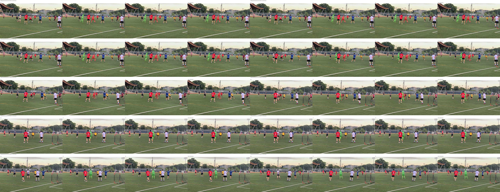
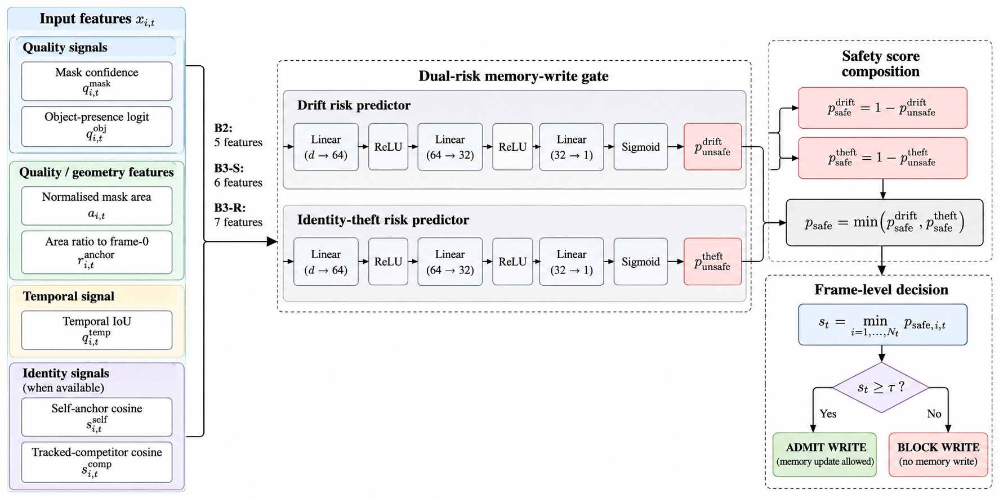

# Chapter 4 - Implementation and Reproducibility

## 4.1 Implementation Objective

The implementation goal was not to modify SAM 3 into a new segmentation
architecture. It was to create a controlled mechanism that could observe the
signals available during tracking and physically decide whether an eligible
non-conditioning frame was allowed to remain in the memory state used by
future propagation.

This distinction governed the engineering design.

SAM 3 remained frozen. The trainable components were limited to small
memory-admission heads operating on scalar tracker signals and native object
pointers. The intervention was evaluated in closed loop, so a write decision
could alter subsequent tracker state rather than merely classify an already
completed trajectory.

The implementation was developed in stages. Each stage first established an
engineering fact required by the research question, then froze the resulting
interface before later evaluation.

## 4.2 Execution Environment

All final thesis experiments were executed on the laboratory workstation with:

- NVIDIA RTX 4080 SUPER, 16 GB VRAM;
- 64 GB system RAM;
- WSL2 Ubuntu 22.04.5;
- Python 3.12.13;
- PyTorch 2.10.0+cu128; and
- CUDA 12.8.

The final SAM 3 source revision was:

`8f0b7f4d4e7eda2ed606ebde6702c93359ad01da`.

The final substrate was constructed using:

`build_sam3_video_model()`.

SAM 3 parameters remained frozen throughout the gate experiments.

The reproducibility environment also pins additional dependencies required by
the SAM 3 and thesis code, including `setuptools<82`, `einops`,
`pycocotools`, and `scipy`. The complete environment is recorded in
`requirements.lock.txt`.

## 4.3 Substrate Selection Under the 16 GB Constraint

An early implementation question was whether the thesis should use the SAM 3
Object Multiplex path or the VOS/PVS tracking path.

The decision was made empirically rather than from the implementation plan.

The Object Multiplex configuration required approximately 21.77 GB of peak
VRAM on the available hardware. Shortening the input clip did not materially
remove this cost, indicating that the configuration did not fit reliably
inside the 16 GB GPU budget.

The non-Multiplex VOS/PVS path used substantially less memory and provided the
tracking interface required by the thesis.

The final thesis therefore uses SAM 3 VOS/PVS.

This is an engineering constraint with scientific consequences: conclusions
apply to the tested VOS/PVS memory interface and should not be presented as
results for the unexecuted Multiplex architecture.

## 4.4 Verification of the Native Memory Path

Before implementing a gate, the thesis first verified that the tracking path
actually exposed a memory-write process that could be controlled.

Instrumentation of the SAM 3 VOS path showed that the memory encoder was
invoked on every propagated frame in the mechanism probes, including a
97-frame run with 97 observed memory-encoding calls.

This observation motivated a write-interface intervention, but it is not
interpreted as evidence that SAM 3 has no other memory-management machinery.
The thesis claim is narrower: the tested VOS path exposed a per-frame
memory-processing opportunity at which an additional explicit admission
decision could be applied.

The observed VOS memory representation included per-object memory features,
while propagation also exposed ordered object identifiers, masks, object
scores, and object pointers required by the final signal definitions.

## 4.5 Native Object-Pointer Verification

The identity part of the research question required a target-specific
representation exposed by the actual VOS tracker.

A development-exposed signal probe verified that SAM 3 VOS exposes a
per-object native object pointer:

`obj_ptr in R^256`.

The pointer was available alongside per-object prediction outputs during
propagation.

This verification was a go/no-go condition for the identity comparison. The
final experiment does not introduce a learned external identity encoder.
Instead, B3-S and B3-R use FP32 cosine relationships derived from the native
SAM 3 object-pointer space.

Identity cosine operations are performed with:

- autocast disabled;
- TF32 disabled; and
- float32 matrix multiplication precision set to `highest`.

This isolates the identity comparison from mixed-precision differences in the
cosine calculation.

## 4.6 Physical Closed-Loop Write Intervention

The final gate is not an offline filter applied after tracking.

For every eligible non-conditioning frame, the implementation computes
per-object admission scores and then a frame-level score. If the frozen
policy blocks the frame, the current non-conditioning frame is physically
evicted from the SAM 3 memory state according to the verified intervention.

Conditioning and prompt frames are retained.

The decision therefore changes the state available to future frames.

The physical action is:

`ADMIT` if `frame_score >= tau`;

otherwise:

`BLOCK`.

A block means no memory write for that eligible non-conditioning frame. It
does not mean that the object or current segmentation output is discarded
from evaluation.

This distinction is important when interpreting the thesis figures: the gate
controls future memory state, not whether the tracker is allowed to produce a
current prediction.

<!-- INTEGRATED_FIGURE:FIG4_2 -->

A real development-exposed mechanism-sanity example of the closed-loop
intervention is shown in [Figure 4.2](#fig-4-2).

**Figure 4.2 — Closed-loop memory-write intervention mechanism sanity
example.** This contact sheet documents the verified state-changing write
intervention on development-exposed mechanism-sanity material. It is included
as implementation evidence and is **not** a selected TEST success example or a
performance claim.

## 4.7 Per-Object to Per-Frame Aggregation

SAM 3 can track multiple objects simultaneously, while the implemented
intervention blocks or retains the current frame-level memory update.

Consequently, object scores are conservatively aggregated as:

`frame_score = minimum object admission score over all tracked objects`.

A low safety score for any tracked object can therefore veto the whole-frame
write.

This aggregation rule is frozen across the learned gates and the B5
write-side comparator.

## 4.8 B1 Manual Quality-and-Temporal Baseline

B1 provides a non-learned reference for the quality-and-temporal signal
family.

The frozen manual rule uses:

- `mask_conf_iou_head`;
- `occ_score_logit`;
- `area_ratio_anchor`; and
- `temporal_iou_prev`.

The rule constructs three reliability terms.

Confidence reliability is:

`q_conf = mask_conf_iou_head * sigmoid(occ_score_logit)`.

Area reliability is based on the ratio between the current object area and
the frame-0 anchor area:

`q_area = min(r, 1/r)`,

where `r` is the current-to-anchor area ratio.

Temporal reliability is:

`q_temp = temporal_iou_prev`.

The B1 object score is the minimum of the frozen reliability terms.

B1 introduces no learned parameters. Its purpose is to determine whether
learning provides value beyond a transparent hand-designed rule using the
same broad quality-and-temporal information family.

## 4.9 B2 Learned Quality-Plus-Temporal Gate

B2 is the final learned quality-plus-temporal condition.

The final B2 input vector contains exactly five predictive features:

1. `mask_conf_iou_head`;
2. `occ_score_logit`;
3. `area_norm`;
4. `area_ratio_anchor`; and
5. `temporal_iou_prev`.

Historical plans contained additional candidate features. They are not part of
the final B2 implementation.

The final five-feature set was frozen because it was already implemented,
causally defined, and independent of unresolved clean-reference state.

The frozen B2 weights are stored in:

`experiments/EXP029_b2core_train/model.json`.

Model SHA256:

`6160a6be9da2058808c16182abe03443014806273df46fe59a86411ffc869ecf`.

The historical artifact name contains `b2core`, but the final feature freeze
promotes this exact model to final B2 rather than retraining it under a renamed
artifact.

## 4.10 B2 Training Architecture

B2 uses two independent failure-typed MLP heads, one for drift and one for
theft.

Each head has:

- input dimension 5;
- `Linear(5,64)`;
- ReLU;
- `Linear(64,32)`;
- ReLU;
- `Linear(32,1)`.

Each head therefore produces one unsafe logit.

The expected parameter count is:

- 2,497 parameters per head;
- 4,994 learned parameters in total.

This is far below the thesis limit of 50,000 trainable gate parameters.

Training was deterministic full-batch PyTorch CPU float64 using independently
weighted binary cross-entropy losses for the two failure types.

The optimizer was AdamW with:

- learning rate `0.001`;
- weight decay `0.0001`;
- betas `(0.9, 0.999)`;
- epsilon `1e-8`;
- 1,000 epochs; and
- no early stopping or DEV tuning.

The B2 normalizer is a TRAIN-only z-score transform fitted on finite B2
training rows. A zero standard deviation is replaced by 1.0.

No DEV or TEST examples are used to train the B2 weights or normalizer.

<!-- INTEGRATED_FIGURE:FIG4_1 -->

The implemented nested signal ladder and write-decision architecture are
summarized in [Figure 4.1](#fig-4-1).

**Figure 4.1 — Signal composition and memory-write decision architecture.**
B2 uses the frozen five-feature quality-plus-temporal input. B3-S adds native
self-pointer similarity and B3-R adds tracked-competitor similarity.
`pointer_valid` is used only for prospective availability routing. Independent
drift and theft heads are composed conservatively through the minimum safe
score, and object-level scores are aggregated by the frozen whole-frame
minimum before physical memory admission.

## 4.11 B3-S Self-Identity Extension

B3-S inherits the complete B2 feature vector and adds:

`ptr_sim_anchor_fp32`.

The resulting input dimension is six.

`ptr_sim_anchor_fp32` is the FP32 cosine similarity between the current native
SAM 3 object pointer and the trusted target anchor.

The architecture of each B3-S failure head remains:

`6 -> 64 -> 32 -> 1`

with ReLU hidden activations.

Expected learned parameter counts are:

- 2,561 parameters per head;
- 5,122 parameters total.

The B3-S comparison therefore changes the information available to the gate
without changing the underlying SAM 3 tracker or introducing a large model.

## 4.12 B3-R Relational Identity Extension

B3-R extends B3-S with:

`max_comp_anchor_cos_fp32`.

Its final input vector therefore contains seven features.

The relational feature is the maximum FP32 cosine similarity between the
current target pointer and the trusted anchors of other currently tracked
objects.

The signal is competitor-relative but restricted to the tracked object set.
It is not a generic external distractor detector.

Each B3-R head uses:

`7 -> 64 -> 32 -> 1`.

Expected learned parameter counts are:

- 2,625 parameters per head;
- 5,250 parameters total.

The frozen B3-S and B3-R weights are stored in:

`experiments/EXP031_b3_train/model.json`.

Model SHA256:

`235076b86aa0975b3ec624aae703575fd4f030381b6af4008c3808f2db71847a`.

## 4.13 Independent Drift and Theft Heads

The neural architecture does not use a shared learned backbone between the
drift and theft predictors.

For each variant, the drift and theft predictors are independent MLP heads.
The training configuration may share the relevant TRAIN-only normalization
procedure, but the neural weights are separate.

The two heads produce:

`p_unsafe_drift`

and:

`p_unsafe_theft`.

Safe probabilities are defined as:

`p_safe_drift = 1 - p_unsafe_drift`

and:

`p_safe_theft = 1 - p_unsafe_theft`.

The final object score is:

`p_safe = min(p_safe_drift, p_safe_theft)`.

Thus either predicted failure type can veto the object-level write score.

No additional post-hoc weighting coefficient, learned fusion layer, or TEST
calibration stage is introduced.

## 4.14 Base-Feature Missingness

Missingness is not silently imputed.

For B2, B3-S, and B3-R, if any required B2 base feature is non-finite, the
object fails closed:

`object admission score = 0`.

The object remains in the frame-level minimum aggregation. It can therefore
block the whole-frame write.

This rule prevents a difficult object from disappearing from the decision
simply because one of its required inputs is missing.

## 4.15 Identity Availability and Hierarchical Routing

Identity availability is handled separately from base-feature missingness.

The availability mask is:

`pointer_valid = object_score_logit > 0`.

`pointer_valid` is not a predictive feature.

It determines which identity-augmented model can be evaluated.

For B3-S:

- valid self identity -> B3-S;
- unavailable self identity -> B2.

For B3-R:

- relational identity available -> B3-R;
- self identity available but relational identity unavailable -> B3-S;
- self identity unavailable -> B2.

For single-object frames, B3-R therefore routes to B3-S when self identity is
available.

This routing rule is prospective and outcome-independent. It does not use
future GT, recovery outcomes, or TEST performance to decide which model is
applied.

An unexpected non-finite identity value in a case where identity is expected
to be computable is treated as an engineering defect rather than silently
rerouted.

## 4.16 B5 DMS-Lite Write-Side Comparator

B5 provides an external-reliability-inspired comparator while preserving the
same physical write intervention used by the thesis gates.

It is explicitly not an exact reproduction of SAM3-DMS.

For tracked object i, B5 uses:

- `mask_conf_iou_head_i`; and
- `occ_score_logit_i`.

If either scalar is non-finite, the object fails closed with score zero.

Otherwise:

`presence_i = 0`

when:

`occ_score_logit_i <= 0`.

For positive object-presence logits:

`presence_i = 2 * sigmoid(occ_score_logit_i) - 1`.

The object reliability score is:

`b5_object_score_i = presence_i * mask_conf_iou_head_i`.

The frame score is the minimum B5 object score across tracked objects, and the
same frozen thresholded admit/block intervention is applied.

The implementation therefore transfers a prospectively frozen reliability
signal into the thesis write-side protocol. It does not claim to reproduce the
read-side memory-selection semantics or reported performance of the external
SAM3-DMS system.

## 4.17 Closed-Loop Evaluator

The final evaluator executes the frozen tracking conditions over the selected
cohorts and records both tracking outcomes and memory-write accounting.

For each gated operating point it records, among other quantities:

- the frozen threshold;
- eligible write opportunities;
- admit count;
- block count;
- realized write rate; and
- trajectory/event outcomes used by POR@30 and ITR@30.

Accounting assertions require:

`admit_count + block_count = eligible_count`

and verify that the stored write rate agrees with:

`admit_count / eligible_count`.

The evaluator does not perform TEST threshold search.

The final TEST artifacts explicitly record:

`threshold_search_performed = False`

and:

`threshold_retuning_performed = False`.

## 4.18 Neutral Exact-Budget Controls

The implementation creates a neutral counterpart for each signal-based
condition.

For each video, the neutral control receives the exact number of admitted
writes used by its paired signal condition.

The identity of admitted frames is selected independently of the signal gate,
while the count is held fixed.

This gives the neutral control the same write budget without reproducing the
signal-based frame selection.

The implementation verifies that signal and neutral admit counts match before
the paired diagnostic is accepted.

## 4.19 Mechanism Sanity Before Final Evaluation

Closed-loop operation was verified before final DEV and TEST evaluation.

A unified mechanism sanity experiment executed B1, B2, B3-S, and B3-R
sequentially on a development-exposed TRAIN video.

The purpose was engineering verification, not a performance claim.

The sanity run checked that:

- the frozen SAM 3 substrate executed;
- each policy produced write decisions;
- the physical block mechanism changed the memory-write state;
- multi-object aggregation remained valid; and
- the variants could execute within the available 16 GB GPU.

Fresh DEV and TEST were not touched by this mechanism sanity run.

Qualitative frames retained from the earlier closed-loop sanity work are used
only as mechanism illustrations in the thesis. They are not presented as TEST
performance evidence.

## 4.20 Compute Feasibility

The final study was designed for the available 16 GB GPU rather than assuming
unlimited accelerator memory.

The Multiplex path was rejected after observed peak memory exceeded the GPU
budget.

The frozen VOS/PVS path and gate variants fit the available hardware.

Because the gates contain only a few thousand trainable parameters, their
parameter memory is negligible relative to frozen SAM 3. The dominant compute
cost remains the underlying tracker and closed-loop video propagation.

Final TEST reporting records peak VRAM and runtime per condition rather than
assuming equal computational cost.

## 4.21 Separation of Training and Tracking Precision

The learned gate heads were trained deterministically on CPU in float64 from
cached scalar features.

At deployment, the frozen SAM 3 tracker retains its native execution
precision, while identity cosine calculations follow the separately frozen
FP32 path.

This separation ensures that the identity comparison is not affected by
autocast or TF32 differences while avoiding unnecessary modification of the
SAM 3 inference path.

## 4.22 Reproducibility Discipline

Every scientific experiment is tied to a frozen repository state.

The workflow follows several rules:

1. implementation and configuration are committed before a scientific run;
2. the working tree is clean before execution;
3. large output artifacts are hashed;
4. experiment status is recorded in `EXPERIMENT_REGISTRY.md`;
5. current project state is recorded in `RESEARCH_STATE.md`;
6. methodological changes are appended as new amendments rather than silently
   rewriting previous decisions; and
7. superseded artifacts remain available for provenance.

This is especially important because the project contains several legitimate
methodological corrections, including the transition from the historical
SAM 3.1 Multiplex expectation to SAM 3 VOS/PVS, the replacement of the early
EXP017 final-split interpretation, and the later correction of synchronized
timing as a whole-scene proxy.

Historical records are therefore retained but are not treated as current
methodology when a later frozen amendment supersedes them.

## 4.23 Frozen Model and Artifact Provenance

The final learned models are identified by both path and hash.

B2:

`experiments/EXP029_b2core_train/model.json`

SHA256:

`6160a6be9da2058808c16182abe03443014806273df46fe59a86411ffc869ecf`

B3-S / B3-R:

`experiments/EXP031_b3_train/model.json`

SHA256:

`235076b86aa0975b3ec624aae703575fd4f030381b6af4008c3808f2db71847a`

The final cohort membership, operating points, TEST outputs, statistical
tables, and thesis-facing assets are likewise retained as repository
artifacts.

This allows the final report to identify not merely an algorithm description
but the exact frozen implementation that generated the reported evidence.

## 4.24 Implemented, Executed, and Superseded Scope

Several ideas appeared in historical planning documents but are not part of
the final experiment.

The final thesis does not use:

- SAM 3.1 Multiplex as the core substrate;
- a learned external identity embedding;
- the deferred phi identity model;
- rolling-clean or EMA identity references as final B3 features;
- centroid displacement as a B2 feature;
- frames-since-clean-write as a B2 feature;
- an oracle clean-state substitute;
- a single undifferentiated B3 condition; or
- TEST-driven threshold repair.

The final implemented and executed core is:

- frozen SAM 3 VOS/PVS;
- B0;
- B1;
- B2;
- B3-S;
- B3-R;
- B5;
- hierarchical missing-identity routing;
- physical closed-loop write blocking;
- development-selected frozen thresholds;
- neutral exact-budget controls; and
- one-touch final TEST evaluation.

This distinction between historical plans and executed methodology is retained
throughout the thesis.

## 4.25 Chapter Summary

The implementation converts the thesis question into a physical intervention
inside frozen SAM 3 tracking.

Native tracker outputs provide the final quality, geometry, temporal, and
pointer-identity signals. Small independent drift/theft MLP heads convert
those signals into conservative object safety scores. Missing identity is
handled by prospective hierarchical routing, object scores are aggregated by
a frame-level minimum, and the resulting threshold decision physically admits
or blocks the current non-conditioning memory write.

The implementation remains small relative to SAM 3, reproducible through
frozen model and artifact hashes, and feasible on the available 16 GB
workstation.

Chapter 5 evaluates the resulting policies under the pre-specified TEST
protocol and reports both their tracking outcomes and the write-rate
constraints that determine which comparisons are scientifically
interpretable.
