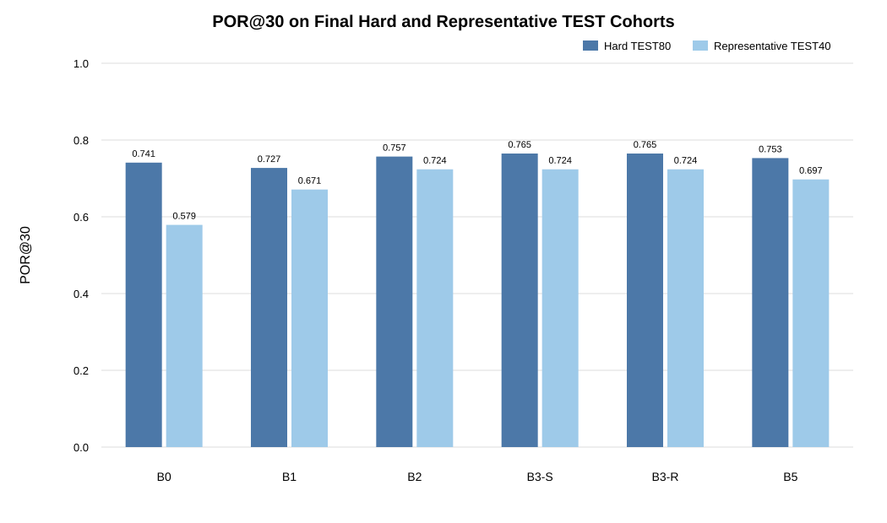
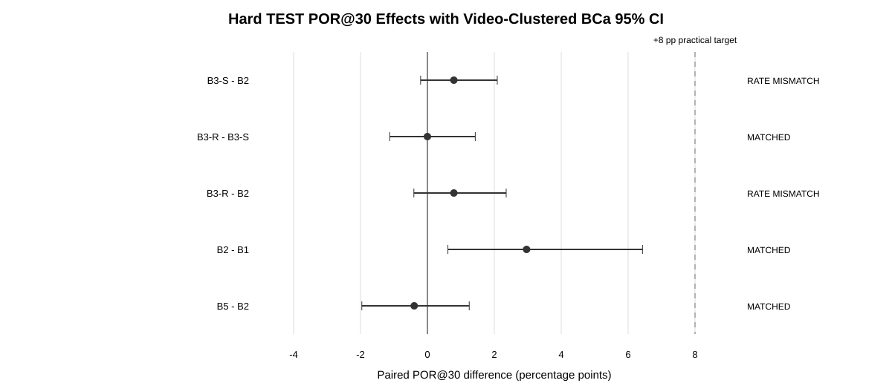
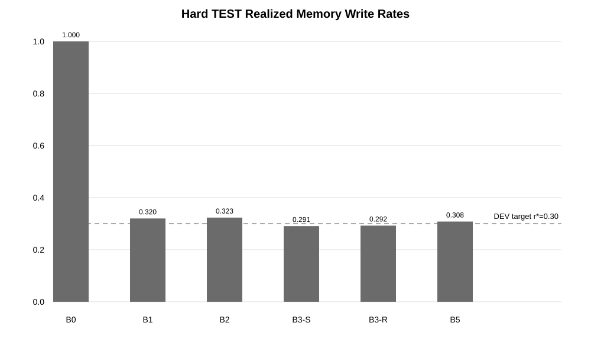
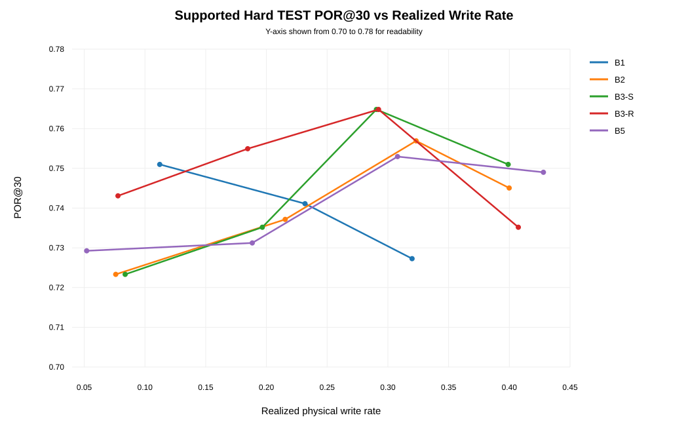

# Chapter 5 - Results

## 5.1 Performance Evaluation

Final evaluation used two pre-frozen cohorts: HARD_TEST80 with 80 videos and
506 primary reappearance events, and REPRESENTATIVE_TEST40 with 40 videos and
76 primary events. All methods were executed under the frozen SAM 3 VOS/PVS
substrate and the final TEST thresholds were not retuned.

On HARD_TEST80, POR@30 was 0.7411 for B0, 0.7273 for B1, 0.7569 for B2,
0.7648 for B3-S, 0.7648 for B3-R, and 0.7530 for B5. The corresponding
ITR@30 values were 0.0593, 0.0514, 0.0316, 0.0395, 0.0336, and 0.0336.
The realized physical write rates were 1.0000 for B0, 0.3199 for B1,
0.3233 for B2, 0.2906 for B3-S, 0.2923 for B3-R, and 0.3080 for B5.

On REPRESENTATIVE_TEST40, POR@30 was 0.5789 for B0, 0.6711 for B1,
0.7237 for B2, 0.7237 for B3-S, 0.7237 for B3-R, and 0.6974 for B5.
These representative-cohort results are reported descriptively as the
development-untouched external-validity anchor.

<!-- INTEGRATED_RESULTS:PERFORMANCE -->

The two frozen evaluation cohorts are reported separately in
[Table 5.1](#tab-5-1) and [Table 5.2](#tab-5-2). The corresponding POR@30
comparison is visualized in [Figure 5.1](#fig-5-1).

**Table 5.1 — HARD_TEST80 headline results.**

| Method | POR@30 | ITR@30 | Write rate | Peak VRAM (GB) | Runtime (s) |
| --- | --- | --- | --- | --- | --- |
| B0 | 0.7411 | 0.0593 | 1.0000 | 15.81 | 2572.7 |
| B1 | 0.7273 | 0.0514 | 0.3199 | 13.11 | 1852.5 |
| B2 | 0.7569 | 0.0316 | 0.3233 | 13.06 | 1878.9 |
| B3_S | 0.7648 | 0.0395 | 0.2906 | 13.06 | 1878.1 |
| B3_R | 0.7648 | 0.0336 | 0.2923 | 13.06 | 1888.7 |
| B5 | 0.7530 | 0.0336 | 0.3080 | 13.03 | 1845.7 |

**Table 5.2 — REPRESENTATIVE_TEST40 headline results.**

| Method | POR@30 | ITR@30 | Write rate | Peak VRAM (GB) | Runtime (s) |
| --- | --- | --- | --- | --- | --- |
| B0 | 0.5789 | 0.0000 | 1.0000 | 11.14 | 541.5 |
| B1 | 0.6711 | 0.0132 | 0.3375 | 11.06 | 528.1 |
| B2 | 0.7237 | 0.0132 | 0.3739 | 10.93 | 534.6 |
| B3_S | 0.7237 | 0.0132 | 0.3581 | 10.94 | 536.1 |
| B3_R | 0.7237 | 0.0000 | 0.3652 | 10.94 | 536.9 |
| B5 | 0.6974 | 0.0132 | 0.3977 | 11.09 | 530.9 |

**Figure 5.1 — POR@30 on HARD_TEST80 and REPRESENTATIVE_TEST40.**
The two cohorts serve different roles: HARD_TEST80 is the frozen primary
difficulty-focused evaluation, whereas REPRESENTATIVE_TEST40 provides a
separate external-validity anchor.

## 5.2 Analysis of Design Solutions

The learned quality-plus-temporal gate B2 improved over the manual B1 rule on
the Hard TEST at closely matched realized write rates. The paired difference
B2 minus B1 was +0.02964 POR@30, with a video-clustered BCa 95% confidence
interval from +0.00612 to +0.06430. The realized write-rate difference was
0.00335, within the frozen 0.02 tolerance.

Adding the tested self-identity pointer signal in B3-S increased the frozen
Hard TEST point estimate over B2 by only +0.00791 POR@30. Its BCa 95%
confidence interval was -0.00204 to +0.02088. However, B3-S and B2 differed
in realized Hard TEST write rate by 0.03270, exceeding the frozen 0.02
tolerance. The primary contrast is therefore RATE_MISMATCH and cannot be
interpreted as a matched-rate primary effect.

Adding tracked-competitor identity in B3-R produced no POR@30 change relative
to B3-S: delta = 0.00000, BCa 95% CI [-0.01129, +0.01431]. This comparison
remained within the frozen TEST write-rate tolerance. Thus, under the tested
frozen formulation, relational pointer identity did not establish incremental
POR@30 benefit over self-identity.

B5, the frozen DMS-lite write-side comparator, differed from B2 by -0.00395
POR@30 with BCa 95% CI [-0.01961, +0.01250] on Hard TEST, while satisfying
the TEST write-rate tolerance.

## 5.3 Final Design Adjustments

All final design changes used in TEST were frozen prospectively. The final B2
feature set contained mask IoU-head confidence, object-presence logit,
normalized mask area, frame-0 anchor area ratio, and temporal IoU to the
previous prediction. B3-S added FP32 self-anchor pointer cosine, while B3-R
added maximum tracked-competitor anchor cosine. Pointer validity remained a
routing mask rather than a predictive input. Missing identity was handled
hierarchically by routing B3-R to B3-S or B2, and B3-S to B2, according to
which identity signals were valid.

The final common DEV target rate was r*=0.30. Frozen headline thresholds were
0.10 for B1, 0.10 for B2, 0.20 for B3-S, 0.20 for B3-R, and 0.70 for B5.
TEST thresholds were never retuned.

## 5.4 Statistical Analysis

The video was the statistical cluster. Primary uncertainty used a paired
video-clustered BCa 95% confidence interval with 50,000 bootstrap replicates
and seed 52. The sole primary endpoint was POR@30 and the primary
research-question contrast was B3-S minus B2.

The primary frozen-threshold point estimate was +0.7905 percentage points,
with BCa 95% CI [-0.2037, +2.0882] percentage points. The upper confidence
bound was below the pre-registered +8 percentage-point practically important
effect threshold. Nevertheless, because the two methods exceeded the frozen
TEST write-rate mismatch tolerance, this interval is not interpreted as a
matched-rate primary-effect estimate.

The secondary B2-minus-B1 contrast showed +2.964 percentage points,
BCa 95% CI [+0.612, +6.430] percentage points, at matched TEST write rate.
The B3-R-minus-B3-S contrast was 0.000 percentage points,
BCa 95% CI [-1.129, +1.431] percentage points, also at matched TEST write
rate.

For the secondary ITR@30 endpoint, B2 minus B1 was -1.976 percentage points,
BCa 95% CI [-4.848, -0.680] percentage points, at matched TEST write rate.
B3-S minus B2 was +0.791 percentage points, BCa 95% CI
[+0.187, +2.407] percentage points, but this pair was RATE_MISMATCH.
B3-R minus B3-S was -0.593 percentage points with BCa 95% CI
[-2.283, +0.412] percentage points.

<!-- INTEGRATED_RESULTS:STATISTICS -->

The pre-specified inferential comparisons are summarized in
[Table 5.3](#tab-5-3) and [Figure 5.2](#fig-5-2).

**Table 5.3 — Key final inferential comparisons.**

| group | endpoint | comparison | a | b | observed delta | ci lower | ci upper | bootstrap replicates | seed |
| --- | --- | --- | --- | --- | --- | --- | --- | --- | --- |
| PRIMARY | POR30 | B3_S_minus_B2 | B3_S | B2 | 0.007905138339921014 | -0.0020366598778004397 | 0.02088167053364276 | 50000 | 52 |
| A10_SECONDARY | POR30 | B3_R_minus_B3_S | B3_R | B3_S | 0.0 | -0.011286681715575564 | 0.01430714812439207 | 50000 | 52 |
| A10_SECONDARY | POR30 | B3_R_minus_B2 | B3_R | B2 | 0.007905138339921014 | -0.004048582995951455 | 0.023552506092412176 | 50000 | 52 |
| A10_SECONDARY | POR30 | B2_minus_B1 | B2 | B1 | 0.029644268774703497 | 0.006122448979591799 | 0.06430155210643018 | 50000 | 52 |
| A10_SECONDARY_B5 | POR30 | B5_minus_B2 | B5 | B2 | -0.0039525691699604515 | -0.019607843137254832 | 0.012499999999999956 | 50000 | 52 |
| MATCHED_NEUTRAL_DIAGNOSTIC | POR30 | B1_minus_B1_NEUTRAL | B1 | B1_NEUTRAL | -0.017786561264822143 | -0.0467479674796748 | 0.005964214711729654 | 50000 | 52 |
| MATCHED_NEUTRAL_DIAGNOSTIC | POR30 | B2_minus_B2_NEUTRAL | B2 | B2_NEUTRAL | -0.005928853754940788 | -0.028297804150365216 | 0.013157894736842146 | 50000 | 52 |
| MATCHED_NEUTRAL_DIAGNOSTIC | POR30 | B3_S_minus_B3_S_NEUTRAL | B3_S | B3_S_NEUTRAL | 0.0 | -0.021452145214521434 | 0.022087867892874324 | 50000 | 52 |
| MATCHED_NEUTRAL_DIAGNOSTIC | POR30 | B3_R_minus_B3_R_NEUTRAL | B3_R | B3_R_NEUTRAL | 0.0019762845849802257 | -0.021113243761996147 | 0.028704317346815725 | 50000 | 52 |
| MATCHED_NEUTRAL_DIAGNOSTIC | POR30 | B5_minus_B5_NEUTRAL | B5 | B5_NEUTRAL | 0.0039525691699604515 | -0.017429193899782147 | 0.0260442787613098 | 50000 | 52 |
| A10_SECONDARY_ITR | ITR30 | B3_S_minus_B2 | B3_S | B2 | 0.007905138339920952 | 0.0018726591760299637 | 0.024066073196459776 | 50000 | 52 |
| A10_SECONDARY_ITR | ITR30 | B3_R_minus_B3_S | B3_R | B3_S | -0.005928853754940712 | -0.022831185995183582 | 0.004123711340206185 | 50000 | 52 |
| A10_SECONDARY_ITR | ITR30 | B2_minus_B1 | B2 | B1 | -0.019762845849802375 | -0.04847703471757987 | -0.006802721088435375 | 50000 | 52 |

**Figure 5.2 — Hard TEST paired POR@30 effects with video-clustered BCa 95%
confidence intervals.** The frozen +8 percentage-point practical-effect target
is shown as context. Comparisons that violate the pre-specified write-rate
tolerance remain explicitly identified as `RATE_MISMATCH`.

## 5.5 Comparisons and Relationships

Outcome-independent exact-K neutral controls matched each signal method
exactly in physical write count for every video. None of the reported
signal-versus-neutral POR@30 confidence intervals established a clear
positive signal-selection advantage. This indicates that part of the observed
performance is attributable to write quantity and emphasizes the importance
of the matched-budget control.

The supported write-rate sweep also showed that method ordering was not
constant across operating rates. Conclusions are therefore based on the
pre-frozen headline operating point together with the supported curve rather
than on a selectively chosen threshold.

<!-- INTEGRATED_RESULTS:WRITE_RATE -->

Realized write-rate status is summarized in
[Table 5.4](#tab-5-4). Headline rates and the supported operating-point
relationship are shown in [Figure 5.3](#fig-5-3) and
[Figure 5.4](#fig-5-4).

**Table 5.4 — Final write-rate status and comparison eligibility.**

| scope | group | comparison | a | b | rate a | rate b | absolute rate difference | tolerance | rate status |
| --- | --- | --- | --- | --- | --- | --- | --- | --- | --- |
| HARD_TEST80 | PRIMARY | B3_S_minus_B2 | B3_S | B2 | 0.29056540649046503 | 0.3232686517229843 | 0.032703245232519274 | 0.02 | RATE_MISMATCH |
| HARD_TEST80 | A10_SECONDARY | B3_R_minus_B3_S | B3_R | B3_S | 0.2923218467714955 | 0.29056540649046503 | 0.001756440281030447 | 0.02 | MATCHED_ON_TEST |
| HARD_TEST80 | A10_SECONDARY | B3_R_minus_B2 | B3_R | B2 | 0.2923218467714955 | 0.3232686517229843 | 0.030946804951488827 | 0.02 | RATE_MISMATCH |
| HARD_TEST80 | A10_SECONDARY | B2_minus_B1 | B2 | B1 | 0.3232686517229843 | 0.3199230511876882 | 0.0033456005352960894 | 0.02 | MATCHED_ON_TEST |
| HARD_TEST80 | A10_SECONDARY_B5 | B5_minus_B1 | B5 | B1 | 0.3079625292740047 | 0.3199230511876882 | 0.01196052191368352 | 0.02 | MATCHED_ON_TEST |
| HARD_TEST80 | A10_SECONDARY_B5 | B5_minus_B2 | B5 | B2 | 0.3079625292740047 | 0.3232686517229843 | 0.015306122448979609 | 0.02 | MATCHED_ON_TEST |
| HARD_TEST80 | A10_SECONDARY_B5 | B5_minus_B3_S | B5 | B3_S | 0.3079625292740047 | 0.29056540649046503 | 0.017397122783539665 | 0.02 | MATCHED_ON_TEST |
| HARD_TEST80 | A10_SECONDARY_B5 | B5_minus_B3_R | B5 | B3_R | 0.3079625292740047 | 0.2923218467714955 | 0.015640682502509218 | 0.02 | MATCHED_ON_TEST |
| REPRESENTATIVE_TEST40 | PRIMARY | B3_S_minus_B2 | B3_S | B2 | 0.3581267217630854 | 0.3738685556867375 | 0.015741833923652082 | 0.02 | MATCHED_ON_TEST |
| REPRESENTATIVE_TEST40 | A10_SECONDARY | B3_R_minus_B3_S | B3_R | B3_S | 0.36521054702872885 | 0.3581267217630854 | 0.00708382526564344 | 0.02 | MATCHED_ON_TEST |
| REPRESENTATIVE_TEST40 | A10_SECONDARY | B3_R_minus_B2 | B3_R | B2 | 0.36521054702872885 | 0.3738685556867375 | 0.008658008658008642 | 0.02 | MATCHED_ON_TEST |
| REPRESENTATIVE_TEST40 | A10_SECONDARY | B2_minus_B1 | B2 | B1 | 0.3738685556867375 | 0.33746556473829203 | 0.03640299094844546 | 0.02 | RATE_MISMATCH |
| REPRESENTATIVE_TEST40 | A10_SECONDARY_B5 | B5_minus_B1 | B5 | B1 | 0.3976780794962613 | 0.33746556473829203 | 0.06021251475796929 | 0.02 | RATE_MISMATCH |
| REPRESENTATIVE_TEST40 | A10_SECONDARY_B5 | B5_minus_B2 | B5 | B2 | 0.3976780794962613 | 0.3738685556867375 | 0.023809523809523836 | 0.02 | RATE_MISMATCH |
| REPRESENTATIVE_TEST40 | A10_SECONDARY_B5 | B5_minus_B3_S | B5 | B3_S | 0.3976780794962613 | 0.3581267217630854 | 0.03955135773317592 | 0.02 | RATE_MISMATCH |
| REPRESENTATIVE_TEST40 | A10_SECONDARY_B5 | B5_minus_B3_R | B5 | B3_R | 0.3976780794962613 | 0.36521054702872885 | 0.03246753246753248 | 0.02 | RATE_MISMATCH |

**Figure 5.3 — Realized Hard TEST write rates.** B0 is shown at its native
physical write rate and is not rate-matched. Direct gated-method
interpretations follow the frozen absolute 0.02 pooled TEST write-rate
tolerance.

**Figure 5.4 — POR@30 versus realized write rate across development-supported
Hard TEST operating points.** The curve is reported so that conclusions do not
depend solely on a single threshold operating point.

## 5.6 Discussion

The clearest positive comparative evidence on the Hard TEST concerned learned
quality-plus-temporal selection: B2 exceeded the manual B1 rule at matched
write rate. In contrast, the native SAM 3 pointer-based self-identity addition
did not establish an incremental POR@30 advantage, and the primary B3-S
versus B2 comparison additionally lost its matched-rate interpretation because
the frozen thresholds realized write rates more than two percentage points
apart on TEST.

The relational identity extension B3-R also did not improve POR@30 over B3-S
at a matched TEST write rate. Representative TEST reinforced the absence of an
observable POR@30 separation among B2, B3-S, and B3-R, all of which obtained
0.7237. These findings should not be generalized to identity information in
general. They apply to the tested frozen SAM 3 pointer-based identity
formulation, its hierarchical missing-identity routing, and the evaluated
MOSEv2 protocol.
